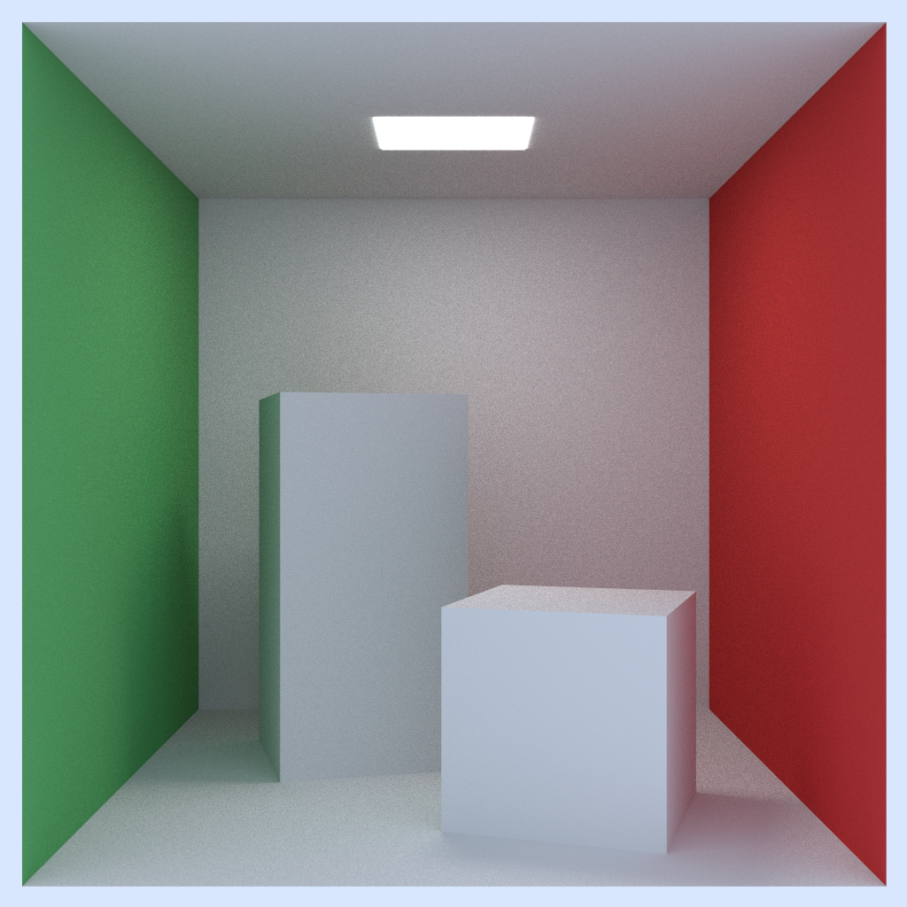

# Rusty Raytracer
Working on completing [_Ray Tracing in One Weekend The Book Series_](https://raytracing.github.io/) in [Rust](https://www.rust-lang.org/).

## Progress
### [_Ray Tracing: The Next Week_](https://raytracing.github.io/books/RayTracingTheNextWeek.html)

  * Motion Blur: Done
  * Bouding Volume Hiararchies: Done
  * Quadrilaterals: Done
  * Instances: Done
  * Lights: Done
  * Textures: In Progress
  

### [_Ray Tracing in One Weekend_](https://raytracing.github.io/books/RayTracingInOneWeekend.html)

* Completed!


## Building
* Clone this repo
* `cargo build` or `cargo build --release`

## Usage

```
Usage: raytracing_weekend.exe [OPTIONS]

Options:
  -o, --output <OUTPUT>          Output image path.  Only TGA output is supported. [default: output/image.tga]
  -d, --demo-scene <DEMO_SCENE>  Demo scene to render:
                                        0 = Random Spheres
                                        1 = Cornell Box.
                                        2 = Qauds [default: 0]
      --width <WIDTH>            Output image width. [default: 1920]
      --height <HEIGHT>          Output image height. [default: 1080]
  -s, --spp <SPP>                Samples per pixel. [default: 50]
  -m, --max-depth <MAX_DEPTH>    Max ray bounce depth. [default: 50]
  -t, --threads <THREADS>        Max number of threads. 1 means disable threading. [default: 32]
  -h, --help                     Print help (see more with '--help')
  -V, --version                  Print version
```
